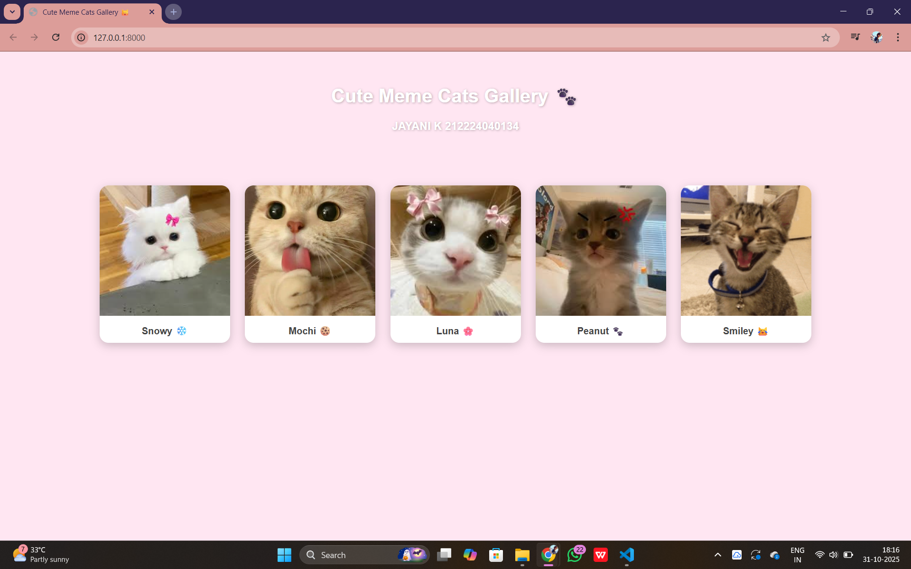
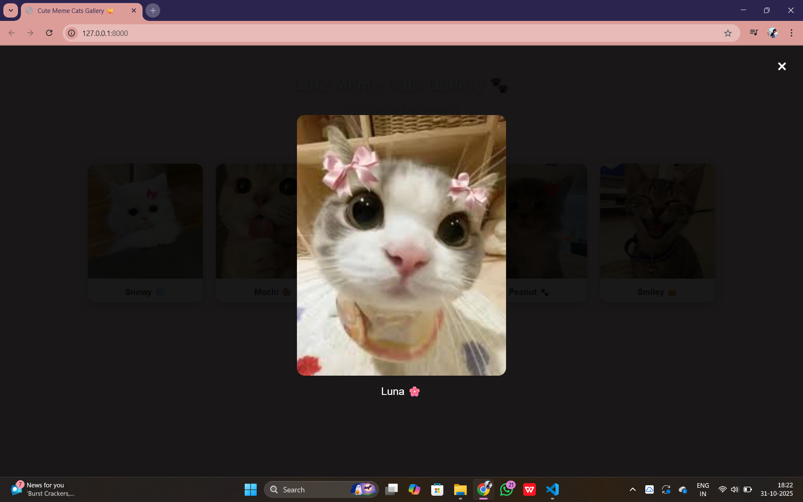

# Ex.08 Design of Interactive Image Gallery
# DATE: 31-10-25

## AIM
  To design a web application for an inteactive image gallery with minimum five images.

## DESIGN STEPS

## Step 1:

Clone the github repository and create Django admin interface

## Step 2:

Change settings.py file to allow request from all hosts.

## Step 3:

Use CSS for positioning and styling.

## Step 4:

Write JavaScript program for implementing interactivit

## Step 5:

Validate the HTML and CSS code

## Step 6:

Publish the website in the given URL.

## PROGRAM
image.html
```

<!DOCTYPE html>
<html lang="en">
<head>
  <meta charset="UTF-8" />
  <meta name="viewport" content="width=device-width, initial-scale=1.0" />
  <title>Cute Meme Cats Gallery 🐱</title>
  <link rel="stylesheet" href="">
</head>
<body>

  <header>
    <h1>Cute Meme Cats Gallery 🐾</h1>
    <h3>JAYANI K 212224040134</h3>
  </header>

  <main class="gallery">
    <div class="image-card">
      
      <p>Snowy ❄️</p>
    </div>
    <div class="image-card">
      
      <p>Mochi 🍪</p>
    </div>
    <div class="image-card">
      
      <p>Luna 🌸</p>
    </div>
    <div class="image-card">
      
      <p>Peanut 🐾</p>
    </div>
    <div class="image-card">
      
      <p>Smiley 😹</p>
    </div>
  </main>

  <div class="popup" id="popup">
    <span class="close" id="close">&times;</span>
    
    <p class="popup-caption" id="popupCaption"></p>
  </div>

  <script src=""></script>
</body>
</html>

```
styles.css
```
body {
  margin: 0;
  font-family: 'Montserrat', sans-serif;
  background-color: #ffe6f2; /* soft light pink */
  color: #222;
  text-align: center;
}


header {
  padding: 30px;
  color: white;
  text-shadow: 1px 1px 4px rgba(0,0,0,0.3);
}

.gallery {
  display: grid;
  grid-template-columns: repeat(auto-fit, minmax(220px, 1fr));
  gap: 25px;
  padding: 40px;
  max-width: 1200px;
  margin: auto;
}

.image-card {
  background: #fff;
  border-radius: 15px;
  box-shadow: 0 5px 15px rgba(0,0,0,0.2);
  overflow: hidden;
  transition: transform 0.3s ease;
}

.image-card:hover {
  transform: scale(1.05);
}

.image-card img {
  width: 100%;
  height: 220px;
  object-fit: cover;
}

.image-card p {
  margin: 10px 0;
  font-weight: bold;
  color: #444;
}

/* Popup */
.popup {
  display: none;
  justify-content: center;
  align-items: center;
  position: fixed;
  inset: 0;
  background: rgba(0,0,0,0.9);
  flex-direction: column;
  z-index: 999;
}

.popup img {
  width: 400px;
  max-width: 90%;
  border-radius: 15px;
}

.popup-caption {
  color: #fff;
  margin-top: 15px;
  font-size: 20px;
}

.close {
  position: absolute;
  top: 20px;
  right: 30px;
  font-size: 35px;
  color: white;
  cursor: pointer;
}

```
script.js
```
const galleryImages = document.querySelectorAll('.gallery img');
const popup = document.getElementById('popup');
const popupImg = document.getElementById('popupImg');
const popupCaption = document.getElementById('popupCaption');
const closeBtn = document.getElementById('close');

galleryImages.forEach(img => {
  img.addEventListener('click', () => {
    popup.style.display = 'flex';
    popupImg.src = img.src;
    popupCaption.textContent = img.nextElementSibling.textContent;
  });
});

closeBtn.addEventListener('click', () => {
  popup.style.display = 'none';
});

```

## OUTPUT



## RESULT
  The program for designing an interactive image gallery using HTML, CSS and JavaScript is executed successfully.
